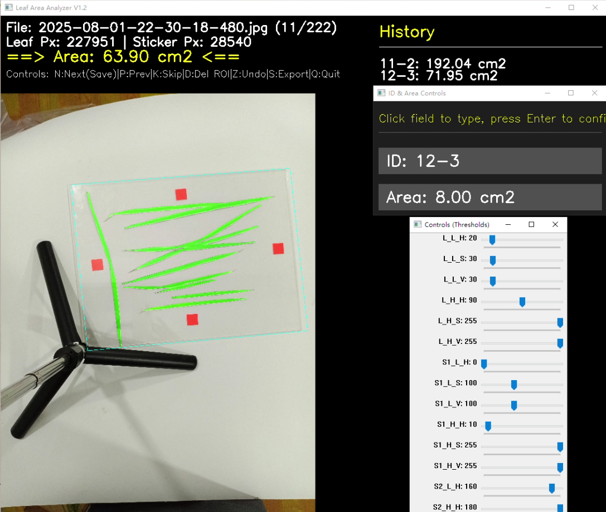

# Leaf Area Analyzer - 智能叶面积分割计算工具

这是一个交互式的计算机视觉工具，旨在快速、准确地测量图像中的叶片面积。它特别适用于需要批量处理植物叶片图像的科研场景。

本工具通过智能的阈值分割、可调节的图像增强以及人性化的交互界面，极大地简化了从包含参照物（如彩色贴纸）的叶片图像中提取叶面积的过程。

  

## ✨ 功能特性

- **交互式ROI选择**:
  - 支持使用鼠标绘制一个或多个**不规则多边形**区域 (ROI)，只在选定区域内进行计算。
  - 支持实时预览正在绘制的ROI。
- **实时可调的图像分割**:
  - **HSV色彩空间**: 基于对光照变化更稳定的HSV色彩空间进行阈值分割，结果更准确。
  - **实时参数调整**: 提供独立的控制面板，可以通过滑动条实时调整叶片和校准物的颜色阈值，并立即在主窗口看到效果。
- **强大的图像增强模块**:
  - **形态学闭操作**: 一键填补叶片或贴纸上因反光、纹理造成的内部空洞，使分割结果更完整。
  - **中性色滤镜**: 智能识别并去除图像中的白色高光或灰色背景干扰，提高分割精度。
- **高效的批量处理工作流**:
  - **文件夹批量加载**: 自动加载指定文件夹内的所有图片。
  - **一键保存与切换**: 使用快捷键`N`即可保存当前分析结果并自动跳转到下一张图片。
  - **操作撤销 (Undo)**: 不小心误操作？按`Z`键即可撤销上一步的保存结果并返回上一张图。
  - **跳过图片**: 对于无需处理的图片，可按`K`键直接跳过。
- **完善的数据记录与导出**:
  - **分组汇总**: 自动将具有相同样本ID的结果进行累加，方便处理一个样本被分成多张图片拍摄的情况。
  - **防错格式导出**: 导出的CSV文件对样本ID进行了特殊处理，防止Excel等软件自动将其识别为日期格式。
- **人性化的UI设计**:
  - **多窗口布局**: 将图像显示、参数控制、数据历史记录分离到不同窗口，操作互不干扰。
  - **无阻塞文本输入**: 在GUI界面内直接完成ID和面积的修改，无需切换到终端，程序不卡死。
  - **清晰的布局**: 图像和信息面板分离，确保图片任何区域都可以被完整选中。

## 🚀 如何使用

### 1. 环境配置

确保您的Python环境中已安装以下依赖包。您可以通过pip进行安装：

```bash
pip install opencv-python pandas
```

### 2. 启动程序

将项目代码下载到本地，然后在终端中运行`main.py`脚本：

```bash
python main.py
```

### 3. 操作流程

1.  **选择文件夹**: 程序启动后会弹出一个对话框，请选择存放您叶片图像的文件夹。
2.  **调整参数 (控制面板)**:
    - **`Controls (Thresholds)` 窗口**:
        - `L_H`, `L_S`, `L_V` ...: 调整叶片 (Leaf) 和贴纸 (Sticker) 的HSV颜色阈值。
        - `Closing Size`: 调整闭操作内核大小以填补孔洞（建议值3, 5, 7；0为关闭）。
        - `Neutral Filter`: 调整中性色滤镜阈值以去除高光（建议值5-20；0为关闭）。
    - **`ID & Area Controls` 窗口**:
        - 点击`ID`或`Area`按钮，然后在窗口内直接用键盘输入新值，按**回车**确认。
3.  **绘制ROI (主窗口)**:
    - 在主图像窗口中，用**鼠标左键**点击来标记ROI的顶点。
    - 标记完成后，用**鼠标右键**闭合多边形。可以绘制多个ROI。
    - 按 `D` 键可以删除最近一个绘制的ROI。
4.  **处理与浏览**:
    - 观察主窗口中绿色（叶片）和红色（贴纸）的覆盖区域，确保分割准确。
    - 右侧的`History`面板会实时显示已保存样本的累计面积。
5.  **键盘快捷键**:
    - `N`: **保存**当前图像的结果，并**跳转到下一张**。
    - `P`: 跳转到**上一张**。
    - `K`: **跳过**当前图像，不保存结果。
    - `D`: **删除**最后一个绘制的ROI。
    - `Z`: **撤销**上一次的保存操作，并返回上一张图。
    - `S`: **手动导出**当前所有结果到CSV文件。
    - `Q`: **退出**程序（退出时会自动导出结果）。

### 4. 查看结果

处理完成后，在您选择的图片文件夹下会生成两个文件：
- `results_details.csv`: 记录了每一张被分析图片的结果详情。
- `results_summary.csv`: 按样本ID汇总后的最终叶面积结果。

## 📝 依赖

- **OpenCV-Python**
- **Pandas**
- **NumPy**
- **Tkinter** (通常作为Python标准库自带，无需额外安装)